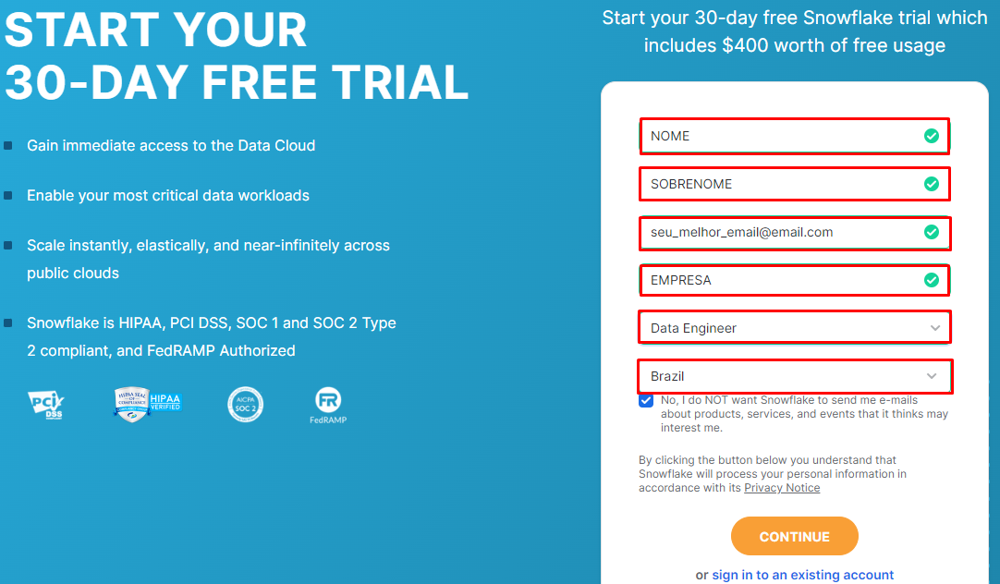

# Criar conta trial Snowflake

Os passos abaixo citados orientam em como criar uma conta de avaliação no Snowflake em um período de 30 dias que inclui 400,00 dolares para uso gratuito

- 1º Vamos acessar o link [https://www.snowflake.com/pt_br/](https://www.snowflake.com/pt_br/) e clicar em __`COMEÇAR GRATUITAMENTE`__:

- 2º Depois vamos preencher os campos

  1. Nome;
  2. Sobrenome;
  3. e-mail;
  4. Empresa
  5. Papel;
  6. País

 

 - 3º Selecionar a edição do Snowflake que vamos utilizar, neste cadastro escolhemos o `Enterprise` que tem acesso aos recursos de `Time Travel`, `Multi-Cluster`, `Waresouses` e `Views Materializadas`
    - 3.a Como `Cloud Provider` Selecionamos AWS, mas se sinta livre para escolher a melhor para você.
    - 3.b A região selecionamos São Paulo por que a mais próxima de nós, proporcionando uma baixa latência.
    - 3.c Após isso basta clicar em `GET STARTED` 
    - 3.d Selecione na lista para qual fim será o seu uso, aqui marcamos como treinamento e certificação
    - 3.e Seleciona sua linguagem favorita.
    - 3.f Seleciona o uso final no snowflake, pode marcar todos os campos disponíveis.

 

 - 4º Após isso você receberá no email cadastrado um link para ativar sua conta.
 
 Esse link expira em 72 horas, então não perca tempo.

 

- 5º Por fim informe um usuário, senha e confirme a senha para acessar o console do Snowflake

# Conclusão

Após aplicar cada etapa indicada o esperado é que no final você tenha acesso a um console no navegador como o mostrado na imagem abaixo.

